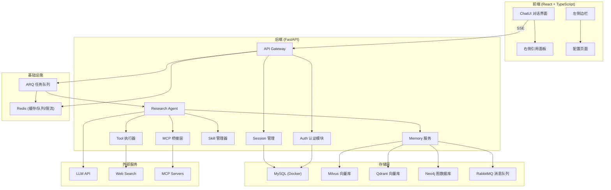
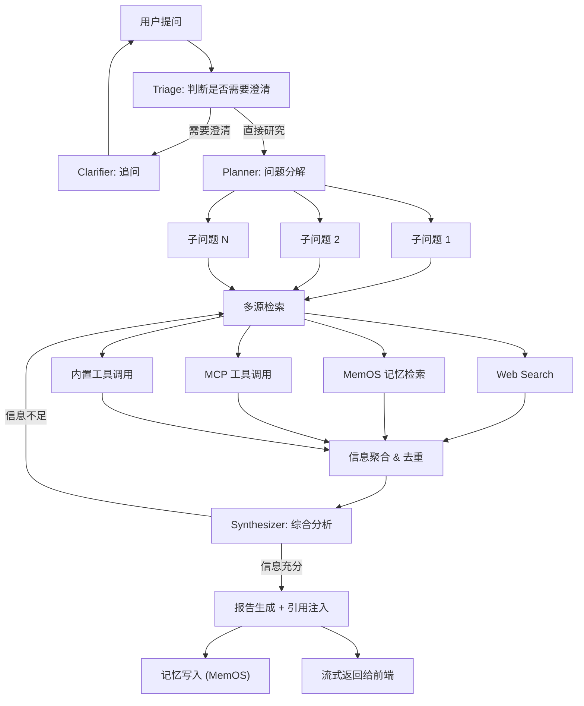
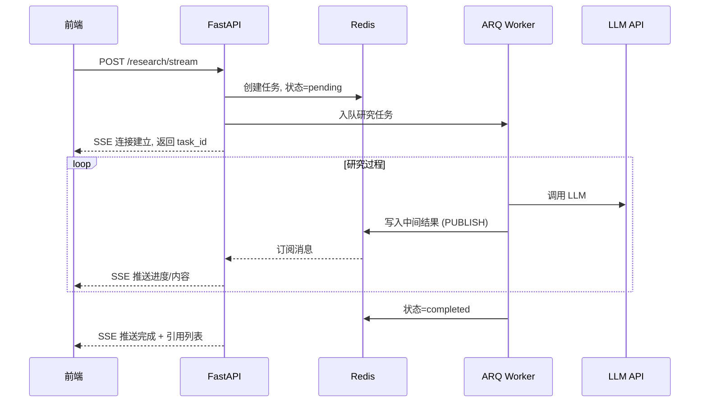
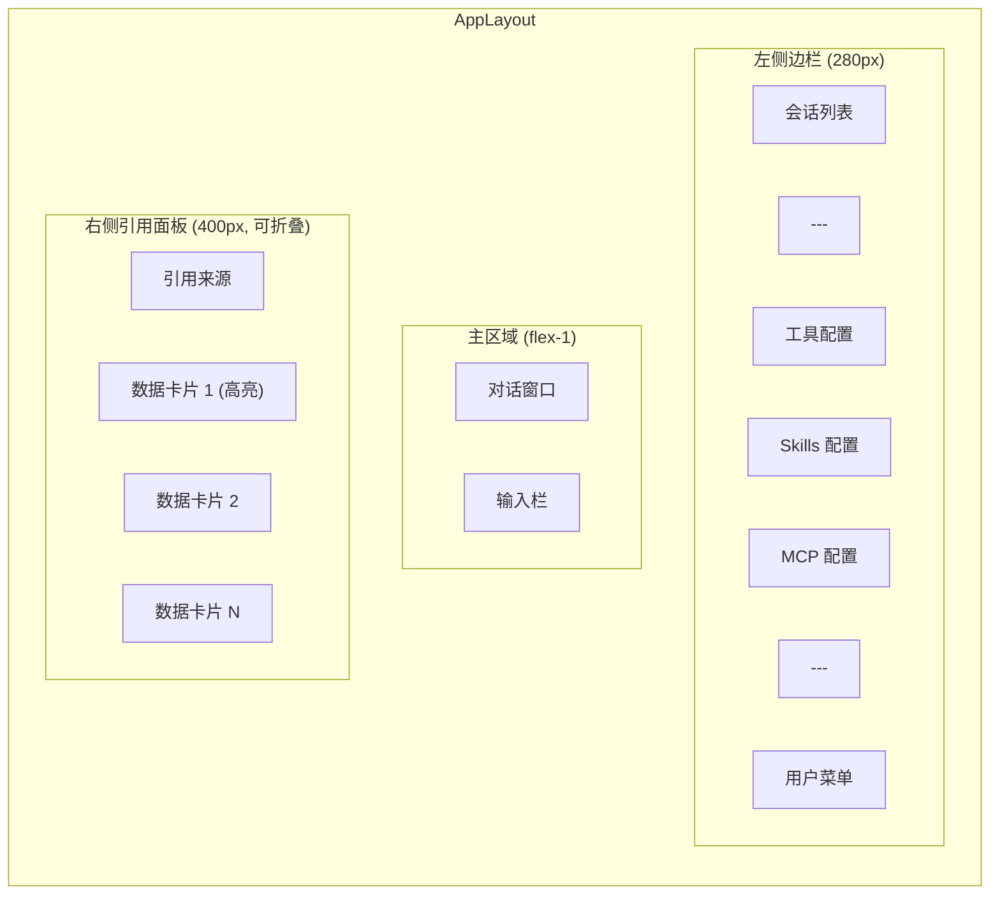

# DeepResearchWeb 项目开发方案

## 一、项目概述

DeepResearchWeb 是一个网页端的深度研究 Agent 系统，具备 Chatbot 交互、深度研究（DeepResearch）、工具调用、Skills/MCP 扩展能力，并集成 MemOS 记忆系统实现用户偏好和知识树记忆。

---

## 二、技术栈

- **后端**: Python 3.11+ / FastAPI / SQLAlchemy / Alembic
- **前端**: TypeScript / React 18 / Vite / TailwindCSS / shadcn/ui
- **数据库**: MySQL 8.0 (Docker 部署) — 用户信息、会话、配置
- **记忆系统**: MemOS SDK (PreferenceTextMemory + TreeTextMemory)
- **向量数据库**: Milvus (偏好记忆) + Qdrant (树形记忆向量索引) — Docker 部署
- **图数据库**: Neo4j (树形记忆图存储) — Docker 部署
- **消息队列**: RabbitMQ (MemOS Scheduler 异步调度) — Docker 部署
- **搜索**: Tavily / SerpAPI / Web Search API / 调用搜索专用 MCP: Brave Search MCP (快速广域搜索, ~669ms) + Firecrawl MCP (深度爬取 & 结构化提取) 
- **LLM**: OpenAI / vllm
- **缓存 & 队列**: Redis 7 (SSE 状态管理、搜索缓存、速率限制) + ARQ (异步任务队列)
- **部署**: Docker Compose 一键编排，支持 100 并发用户

---

## 三、系统架构




---

## 四、后端设计 (FastAPI)

### 4.1 目录结构

```
backend/
├── app/
│   ├── main.py                  # FastAPI 入口
│   ├── config.py                # 配置管理
│   ├── api/
│   │   ├── v1/
│   │   │   ├── auth.py          # 登录/注册/JWT
│   │   │   ├── chat.py          # 对话 & 流式响应
│   │   │   ├── research.py      # DeepResearch 入口
│   │   │   ├── tools.py         # 工具 CRUD & 调用
│   │   │   ├── skills.py        # Skills CRUD
│   │   │   ├── mcp.py           # MCP 服务器管理
│   │   │   ├── memory.py        # 记忆查看 & 反馈
│   │   │   └── sessions.py      # 会话管理
│   │   └── deps.py              # 依赖注入
│   ├── core/
│   │   ├── security.py          # JWT / 密码哈希
│   │   ├── middleware.py        # CORS / 限流
│   │   ├── redis.py             # Redis 连接池 & 工具函数
│   │   ├── rate_limiter.py      # 基于 Redis 的速率限制器
│   │   └── cache.py             # 搜索结果 & LLM 响应缓存
│   ├── models/                  # SQLAlchemy ORM
│   │   ├── user.py
│   │   ├── session.py
│   │   ├── message.py
│   │   ├── tool_config.py
│   │   ├── skill_config.py
│   │   └── mcp_config.py
│   ├── schemas/                 # Pydantic 模型
│   ├── services/
│   │   ├── research/            # DeepResearch 核心
│   │   │   ├── agent.py         # Research Agent 主逻辑
│   │   │   ├── planner.py       # 问题分解 & 规划
│   │   │   ├── searcher.py      # 搜索 & 信息获取
│   │   │   ├── synthesizer.py   # 综合 & 报告生成
│   │   │   └── citation.py      # 引用解析 & 管理
│   │   ├── memory_service.py    # MemOS 封装
│   │   ├── tool_service.py      # 工具调用
│   │   ├── skill_service.py     # Skill 执行
│   │   └── mcp_service.py       # MCP 协议桥接
│   ├── agents/
│   │   ├── base.py              # Agent 基类
│   │   ├── chat_agent.py        # 普通聊天 Agent
│   │   └── research_agent.py    # DeepResearch Agent
│   ├── workers/
│   │   ├── research_worker.py   # ARQ Worker: DeepResearch 异步执行
│   │   └── memory_worker.py     # ARQ Worker: 记忆写入异步执行
│   ├── utils/
│   │   └── logger.py            # 日志工具类
│   └── db/
│       ├── database.py          # 数据库连接 & 连接池配置
│       └── migrations/          # Alembic 迁移
├── requirements.txt
├── Dockerfile
└── alembic.ini
```

### 4.2 核心 API 端点


| 端点                               | 方法                  | 说明                                    |
| -------------------------------- | ------------------- | ------------------------------------- |
| `/api/v1/auth/register`          | POST                | 用户注册                                  |
| `/api/v1/auth/login`             | POST                | 用户登录，返回 JWT                           |
| `/api/v1/chat/stream`            | POST (SSE)          | 普通聊天 + 流式输出                           |
| `/api/v1/research/stream`        | POST (SSE)          | 提交 DeepResearch 任务，返回 task_id + SSE 流 |
| `/api/v1/research/tasks/{id}`    | GET                 | 查询研究任务状态 & 进度                         |
| `/api/v1/sessions`               | GET/POST/DELETE     | 会话 CRUD                               |
| `/api/v1/tools`                  | GET/POST/PUT/DELETE | 工具配置 CRUD                             |
| `/api/v1/skills`                 | GET/POST/PUT/DELETE | Skill 配置 CRUD                         |
| `/api/v1/mcp/servers`            | GET/POST/PUT/DELETE | MCP 服务器管理                             |
| `/api/v1/mcp/servers/{id}/tools` | GET                 | 获取 MCP 工具列表                           |
| `/api/v1/memory/search`          | POST                | 记忆检索                                  |
| `/api/v1/memory/feedback`        | POST                | 记忆反馈修正                                |


### 4.3 数据库模型 (MySQL)

- **User**: id, username, email, hashed_password, created_at
- **Session**: id, user_id, title, mode(chat/research), created_at, updated_at
- **Message**: id, session_id, role, content, citations_json, created_at
- **ToolConfig**: id, user_id, name, type(builtin/custom), config_json, enabled
- **SkillConfig**: id, user_id, name, description, prompt_template, enabled
- **MCPServerConfig**: id, user_id, name, transport(stdio/sse), command, url, env_json, enabled

---

## 五、DeepResearch 工作流

参考 OpenAI Deep Research 四阶段流水线和 LightRAG 的双级检索模式：




### 关键设计点

- **Planner**: 使用 LLM 将复杂问题拆解为可独立检索的子问题，每个子问题标注检索策略（web/memory/mcp/tool）
- **多源检索**: 并行执行 Web 搜索、MemOS 记忆检索、MCP 工具调用，汇总结果
- **Synthesizer**: 综合所有检索结果，判断信息是否充分；不足则迭代检索（最多 3 轮）
- **引用注入**: 在生成的回答中，为每个论述点插入 `[n]` 格式引用标记，附带来源 URL、标题等元数据
- **记忆写入**: 研究结果和用户偏好异步写入 MemOS

---

## 5.1 并发与性能设计 (100 用户并发)

### 异步任务架构

DeepResearch 是长时任务（30s-2min），不能在 API worker 中同步执行。采用 **ARQ + Redis** 异步任务队列：




### 关键并发参数

- **API 层**: gunicorn + 4 uvicorn workers, 每 worker 支持异步 IO
- **任务队列**: ARQ workers x 8, 最大并发研究任务 50（信号量控制）
- **MySQL 连接池**: pool_size=20, max_overflow=30, pool_recycle=3600
- **Milvus 连接池**: max_connections=30
- **Qdrant 连接池**: grpc_port=6334, prefer_grpc=True, limits=100 (TreeTextMemory 向量检索)
- **Neo4j 连接池**: max_connection_pool_size=50
- **RabbitMQ**: heartbeat=60, connection_attempts=3 (MemOS Scheduler 异步记忆处理)
- **Redis 连接池**: max_connections=100

### LLM 并发控制

```python
import asyncio

class LLMRateLimiter:
    def __init__(self, max_concurrent=20, rpm_limit=500):
        self._semaphore = asyncio.Semaphore(max_concurrent)
        self._rpm_limit = rpm_limit

    async def call(self, func, *args, **kwargs):
        async with self._semaphore:
            return await func(*args, **kwargs)
```

- 全局信号量限制同时进行的 LLM 调用数（默认 20）
- 基于 Redis 的滑动窗口速率限制（RPM/TPM）
- 超限时排队等待，不直接拒绝

### 搜索结果缓存

- 基于 Redis, key = hash(query + search_params), TTL = 30min
- 相似查询（编辑距离 < 阈值）命中缓存，减少外部 API 调用
- 缓存命中率目标 > 30%（研究类查询重复度较高）

### MCP Server 进程池

- 全局共享 MCP Server 进程（同一配置的 Server 只启动一个进程）
- 通过连接复用 + 请求排队避免每用户独占一个进程
- 最大进程数限制: 20，超限时等待或拒绝
- 空闲超时自动回收: 5min 无请求则关闭进程

### SSE 连接管理

- 通过 Redis Pub/Sub 实现 Worker -> API -> Client 的消息传递
- API 层只负责 SSE 推送，不参与研究计算
- 断线重连: 客户端携带 `Last-Event-ID`，API 从 Redis 读取缓存的事件流重放

---

## 六、MemOS 记忆系统集成

以 SDK 方式引入 MemOS，使用 `PreferenceTextMemory` 和 `TreeTextMemory`。

### 6.1 服务封装 (`services/memory_service.py`)

```python
from memos.memories.textual.preference import PreferenceTextMemory
from memos.memories.textual.tree import TreeTextMemory
from memos.mem_feedback.simple_feedback import SimpleMemFeedback

class MemoryService:
    def __init__(self, pref_config, tree_config, feedback_config):
        self.pref_mem = PreferenceTextMemory(pref_config)
        self.tree_mem = TreeTextMemory(tree_config)
        self.feedback = SimpleMemFeedback(...)

    async def add_preference(self, messages, user_id, session_id):
        """从对话中提取并存储用户偏好记忆"""
        memories = self.pref_mem.get_memory(
            messages, type="chat",
            info={"user_id": user_id, "session_id": session_id}
        )
        return self.pref_mem.add(memories)

    async def add_tree_memory(self, memories, user_name):
        """添加树形结构记忆（知识点、研究成果）"""
        return self.tree_mem.add(memories, user_name=user_name)

    async def search(self, query, user_id, top_k=10):
        """联合检索偏好记忆和树形记忆"""
        pref_results = self.pref_mem.search(query, top_k=top_k)
        tree_results = self.tree_mem.search(
            query, top_k=top_k, mode="hybrid"
        )
        return self._merge_and_rank(pref_results, tree_results)

    async def process_feedback(self, user_id, session_id,
                                chat_history, feedback_content):
        """处理用户对记忆的反馈修正"""
        return self.feedback.process_feedback(
            user_id=user_id,
            user_name=f"cube_{user_id}",
            chat_history=chat_history,
            feedback_content=feedback_content,
        )
```

### 6.2 依赖服务 (Docker)

- **Milvus**: PreferenceTextMemory 的向量存储 (explicit_preference / implicit_preference collection)
- **Qdrant v1.15+**: TreeTextMemory 的向量索引 (REST 6333, gRPC 6334)，default_config 中 vector_db backend 为 qdrant
- **Neo4j 5**: TreeTextMemory 的图存储 (bolt://localhost:7687)
- **RabbitMQ**: MemOS Scheduler 的异步任务队列 (pika, 端口 5672/15672)，用于异步记忆重组织、日志上报等
- **Embedding 服务**: bge-large-zh-v1.5 或兼容接口

---

## 七、工具 / Skills / MCP 系统

参考 OpenClaw 的三层设计：

### 7.1 工具 (Tools)

- **内置工具**: web_search, url_fetch, code_execute, file_read
- **自定义工具**: 用户通过配置页面定义 OpenAI function calling 格式的工具（name, description, parameters JSON Schema）
- **执行**: Agent 通过 LLM tool_call 机制触发，后端 ToolExecutor 路由到对应实现

### 7.2 Skills

- 本质是 **带结构化 prompt 的指令模板**，教 Agent "如何思考某类任务"
- 配置项: name, description, trigger_keywords, system_prompt, required_tools
- 用户在配置页面创建/编辑 Skill，Agent 根据用户输入自动匹配适用的 Skill

### 7.3 MCP (Model Context Protocol)

- **参考 OpenClaw 的 mcporter 桥接方式**，后端维护 MCP Server 进程池
- 支持 stdio 和 SSE 两种 transport
- 配置项: name, transport, command/url, args, env, enabled
- 后端通过 `mcp` Python SDK 与 MCP Server 通信，将 MCP 工具暴露给 Agent
- 工具列表动态发现: 连接 MCP Server 后自动获取 `tools/list`

```python
from mcp import ClientSession, StdioServerParameters
from mcp.client.stdio import stdio_client

class MCPBridge:
    async def connect(self, server_config):
        params = StdioServerParameters(
            command=server_config.command,
            args=server_config.args,
            env=server_config.env,
        )
        async with stdio_client(params) as (read, write):
            async with ClientSession(read, write) as session:
                await session.initialize()
                tools = await session.list_tools()
                return tools

    async def call_tool(self, server_id, tool_name, arguments):
        # 调用指定 MCP Server 的工具
        result = await session.call_tool(tool_name, arguments)
        return result
```

---

## 八、前端设计 (React + TypeScript)

### 8.1 目录结构

```
frontend/
├── src/
│   ├── App.tsx
│   ├── main.tsx
│   ├── api/                     # API 调用层
│   │   ├── client.ts            # axios 实例 + 拦截器
│   │   ├── auth.ts
│   │   ├── chat.ts
│   │   ├── tools.ts
│   │   ├── skills.ts
│   │   └── mcp.ts
│   ├── components/
│   │   ├── layout/
│   │   │   ├── AppLayout.tsx    # 三栏布局
│   │   │   ├── Sidebar.tsx      # 左侧边栏
│   │   │   └── ReferencePanel.tsx # 右侧引用面板
│   │   ├── chat/
│   │   │   ├── ChatWindow.tsx   # 对话窗口
│   │   │   ├── MessageBubble.tsx
│   │   │   ├── CitationLink.tsx # 引用链接组件
│   │   │   ├── ResearchProgress.tsx # 研究进度
│   │   │   └── InputBar.tsx
│   │   ├── config/
│   │   │   ├── ToolsConfig.tsx
│   │   │   ├── SkillsConfig.tsx
│   │   │   └── MCPConfig.tsx
│   │   └── common/
│   │       ├── ReferenceCard.tsx # 引用数据卡片
│   │       └── Modal.tsx
│   ├── hooks/
│   │   ├── useSSE.ts            # SSE 流式消息
│   │   ├── useAuth.ts
│   │   └── useReferences.ts     # 引用面板状态
│   ├── stores/                  # Zustand 状态管理
│   │   ├── authStore.ts
│   │   ├── chatStore.ts
│   │   └── referenceStore.ts
│   ├── types/
│   │   └── index.ts
│   └── utils/
├── index.html
├── vite.config.ts
├── tailwind.config.ts
├── tsconfig.json
└── package.json
```

### 8.2 页面布局 (三栏结构)




### 8.3 引用系统设计 (核心交互)

这是前端最核心的交互功能：

**数据结构**:

```typescript
interface Citation {
  id: string;           // 引用 ID，如 "[1]"
  index: number;        // 引用序号
  url: string;          // 来源 URL
  title: string;        // 文档/网页标题
  snippet: string;      // 摘要片段
  source_type: string;  // "web" | "mcp" | "memory" | "document"
  favicon?: string;     // 网站图标
}

interface Message {
  id: string;
  role: "user" | "assistant";
  content: string;      // 包含 [1][2] 等引用标记的 markdown
  citations: Citation[];
}
```

**交互流程**:

1. 后端在 SSE 流式返回时，最后附带 `citations` 数组
2. 前端渲染 markdown 时，将 `[n]` 替换为可点击的 `<CitationLink>` 组件（上标样式）
3. 用户点击任意 `[n]`，右侧面板自动展开（如已关闭），展示当前消息的所有引用卡片
4. 被点击的引用对应的卡片会高亮显示，并自动滚动到可视区域
5. 每张引用卡片包含: favicon + 标题 + URL + 摘要片段 + 来源类型标签

`**ReferencePanel` 组件逻辑**:

```typescript
const ReferencePanel: React.FC = () => {
  const { activeCitations, highlightedId } = useReferenceStore();

  return (
    <aside className="w-[400px] border-l overflow-y-auto">
      <h3>引用来源</h3>
      {activeCitations.map((cite) => (
        <ReferenceCard
          key={cite.id}
          citation={cite}
          isHighlighted={cite.id === highlightedId}
        />
      ))}
    </aside>
  );
};
```

### 8.4 左侧边栏导航

点击 "工具配置" / "Skills 配置" / "MCP 配置" 时，主区域切换到对应配置页面：

- **ToolsConfig**: 工具列表 + 启用/禁用开关 + 添加自定义工具表单
- **SkillsConfig**: Skill 列表 + 编辑 prompt 模板 + 绑定工具
- **MCPConfig**: MCP 服务器列表 + 添加服务器（transport/command/url/env）+ 连接测试 + 工具列表预览

---

## 九、Docker Compose 编排

```yaml
# docker-compose.yml
version: "3.9"
services:
  mysql:
    image: mysql:8.0
    environment:
      MYSQL_ROOT_PASSWORD: ${MYSQL_ROOT_PASSWORD}
      MYSQL_DATABASE: deepresearch
    ports: ["3306:3306"]
    volumes: ["mysql_data:/var/lib/mysql"]

  neo4j:
    image: neo4j:5
    environment:
      NEO4J_AUTH: neo4j/${NEO4J_PASSWORD}
    ports: ["7474:7474", "7687:7687"]
    volumes: ["neo4j_data:/data"]

  milvus:
    image: milvusdb/milvus:v2.4-latest
    ports: ["19530:19530"]
    volumes: ["milvus_data:/var/lib/milvus"]

  qdrant:
    image: qdrant/qdrant:v1.15.3
    ports: ["6333:6333", "6334:6334"]
    volumes: ["qdrant_data:/qdrant/storage"]
    environment:
      QDRANT__SERVICE__GRPC_PORT: 6334
      QDRANT__SERVICE__HTTP_PORT: 6333

  rabbitmq:
    image: rabbitmq:3-management-alpine
    ports: ["5672:5672", "15672:15672"]
    environment:
      RABBITMQ_DEFAULT_USER: ${RABBITMQ_USER:-guest}
      RABBITMQ_DEFAULT_PASS: ${RABBITMQ_PASSWORD:-guest}
    volumes: ["rabbitmq_data:/var/lib/rabbitmq"]

  redis:
    image: redis:7-alpine
    ports: ["6379:6379"]
    volumes: ["redis_data:/data"]
    command: redis-server --maxmemory 512mb --maxmemory-policy allkeys-lru

  backend:
    build: ./backend
    ports: ["8000:8000"]
    depends_on: [mysql, neo4j, milvus, qdrant, rabbitmq, redis]
    env_file: .env
    command: gunicorn app.main:app -w 4 -k uvicorn.workers.UvicornWorker --bind 0.0.0.0:8000

  worker:
    build: ./backend
    depends_on: [redis, mysql, neo4j, milvus, qdrant, rabbitmq]
    env_file: .env
    command: arq app.workers.research_worker.WorkerSettings
    deploy:
      replicas: 2

  frontend:
    build: ./frontend
    ports: ["3000:3000"]
    depends_on: [backend]

volumes:
  mysql_data:
  neo4j_data:
  milvus_data:
  qdrant_data:
  rabbitmq_data:
  redis_data:
```

---

## 十、关键文件与依赖

**后端 `requirements.txt` 核心依赖**:

- fastapi, uvicorn, gunicorn, sqlalchemy, alembic, pymysql
- pyjwt, passlib, python-multipart
- redis[hiredis], arq (Redis 连接 & 异步任务队列)
- MemoryOS[all] (MemOS SDK，路径: `/Users/xiniuyiliao/Desktop/code/MemOS`，含 qdrant-client, neo4j, pika 等依赖)
- mcp (MCP Python SDK)
- httpx, aiohttp (异步 HTTP)
- tavily-python 或 serpapi (Web 搜索)
- openai, anthropic (LLM)

**前端 `package.json` 核心依赖**:

- react, react-dom, react-router-dom
- @tanstack/react-query (数据请求)
- zustand (状态管理)
- tailwindcss, @shadcn/ui
- react-markdown, remark-gfm (Markdown 渲染)
- lucide-react (图标)
- axios

---

## 十一、开发阶段规划


| 阶段  | 内容                                                               | 预计周期  |
| --- | ---------------------------------------------------------------- | ----- |
| P0  | 项目脚手架 + Docker 环境 (MySQL/Redis/Neo4j/Milvus) + 用户系统 + 基础 Chat UI | 1 周   |
| P1  | DeepResearch Agent 核心流程 (Planner + Searcher + Synthesizer + 引用)  | 2 周   |
| P2  | ARQ 任务队列 + Redis Pub/Sub SSE + LLM 并发控制 + 搜索缓存                   | 1 周   |
| P3  | MemOS 集成 (PreferenceTextMemory + TreeTextMemory + MemFeedback)   | 1 周   |
| P4  | 工具调用 + Skills + MCP 系统 (含进程池) + 前端配置页面                           | 1.5 周 |
| P5  | 引用面板交互优化 + 研究进度展示 + 流式体验打磨                                       | 1 周   |
| P6  | 并发压测 (100 用户) + 连接池调优 + 部署文档 + Docker Compose 完善                 | 1 周   |


